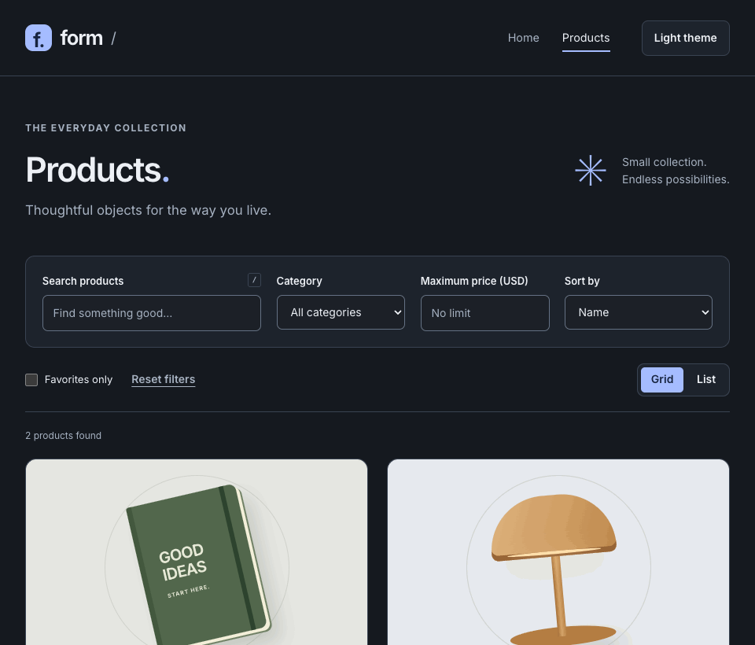

# React Router Product Demo

[](https://react.dev/)
[](https://github.com/fatmakahveci/react-ts-blog/actions/workflows/test.yml)
[](https://github.com/fatmakahveci/react-ts-blog/commits/main)

A React and TypeScript routing exercise with nested layouts, product detail routes, and route-level error handling.

## Demo



## Highlights

- Nested routes with a shared root layout
- Product list and parameterized product-detail pages
- Dedicated error boundary page
- Friendly recovery links for unknown product identifiers
- Declarative navigation with React Router
- Shareable product search with empty states and preserved filters on return
- Keyboard skip link, route focus management, and page titles
- Automated lint, formatting, coverage, dependency updates, and CI checks

## Catalog Features

1. **Category filter:** narrow the catalog to Stationery or Electronics.
2. **Sorting:** order by name, lowest price, or highest price.
3. **Price limit:** filter by a maximum USD price, including zero.
4. **Favorites:** save products from the catalog or detail page and show only favorites.
5. **Grid/list view:** choose and retain your preferred catalog layout.
6. **Recently viewed:** revisit up to four unique products, newest first.
7. **Copy product link:** share a product without including your search filters; a manual copy field is available if clipboard access fails.
8. **Light/dark theme:** switch themes using the header control.
9. **Reset filters:** clear catalog filters and sorting while preserving unrelated URL parameters.
10. **Search shortcut:** press `/` outside editable fields to focus search.

Search, category, price, sorting, and favorites-only mode are stored in the URL
and preserved when returning from product details. Favorites, recent items,
theme, and layout are stored locally in your browser; they are not synced to an
account. If browser storage is unavailable, controls still work during the
current page visit. The catalog contains sample products and prices.

## Technology

- React
- TypeScript
- React Router
- Vite and Vitest
- React Testing Library and CSS Modules

## Getting Started

### Prerequisites

- Node.js 22.23.3 (see `.nvmrc`)
- npm

### Installation

```bash
nvm use
npm ci
npm start
```

Open http://localhost:5173. No credentials or backend setup are required.

## Quality Checks

```bash
npm run check
npm run test:watch
npx playwright install chromium
npm run test:e2e
npm run format
npm audit --audit-level=low
```

The checks enforce Biome lint and formatting rules, run Vitest with coverage thresholds (85% lines/functions/statements and 80% branches), then type-check and build the app. Coverage reports are written to `coverage/`; open `coverage/index.html` for the detailed report.

The tests cover product search, URL state, navigation, recovery paths, keyboard access, and unmatched routes. The build includes strict TypeScript checking. Production output is written to `dist/`; use `npm run preview` to inspect it locally. Configure your static host to serve `index.html` for application routes such as `/products/1`.

### Tooling migration

Create React App was replaced with Vite to resolve the TypeScript installation conflict and remove the obsolete webpack-based dependency chain. `npm start` remains available; CRA-specific flags such as `--watchAll=false` and the `eject` command are no longer used.

## CI / CD

GitHub Actions runs lint, coverage thresholds, TypeScript checks, a production
build, Chromium end-to-end tests, and a dependency audit for pull requests and pushes to `main`. A weekly
run also checks the default branch for newly reported dependency vulnerabilities.
Coverage and browser-test reports are retained as workflow artifacts for 14 days.
Browser tests exercise both normal routing and the Pages subpath/hash build,
including error recovery focus, sharing, persistence, and mobile layouts.

After a successful push to `main`, the workflow builds and deploys the site to
GitHub Pages. Pull requests and scheduled runs never deploy. You can also run
**Actions → CI / CD → Run workflow** on `main` to repeat checks and deployment.
Deployments use the `github-pages` environment and the repository's automatic
`GITHUB_TOKEN`; no personal deployment token is required.

In **Settings → Pages**, the publishing source must be **GitHub Actions**. This
has been enabled for the current repository. Push changes to `main` to trigger
checks and deployment. The deployed URL is
shown on the workflow's deployment and environment pages. The site base path is
read from Pages metadata, including when a custom domain is configured.

Pages builds use hash routes, for example `/react-ts-blog/#/products/1`, so direct
links and refreshes work on static hosting. Local development keeps normal browser
routes. Preview the Pages configuration locally with:

```bash
VITE_BASE_PATH=/react-ts-blog/ VITE_ROUTER_MODE=hash npm run build
VITE_BASE_PATH=/react-ts-blog/ npm run preview
```

The existing release/manual GHCR source-package workflow also requires the shared
quality checks to pass before publishing. Workflow actions are pinned to commit
SHAs, with updates managed by Dependabot.

## Repository Structure

- `src/main.tsx` — application entry point
- `src/app/App.tsx` — application and route configuration
- `src/app/pages/` — route-level components named with the `Page` suffix
- `src/app/layouts/` — shared page layouts
- `src/app/components/` — shared navigation UI
- `src/data/` — product catalog data
- `src/hooks/` — persistent preference state and storage validation
- `src/types/` — domain types and module declarations
- `src/styles/` — global styles
- `src/assets/` — bundled images and graphics
- `src/test/` — shared test setup; component tests live beside their components
- `public/` — static assets served directly

React components use PascalCase filenames matching their component names.
Other source files use descriptive lowercase or kebab-case names. Files without
JSX use `.ts`; React components and their tests use `.tsx`.

## Project Resources

- [Changelog](CHANGELOG.md)
- [Contributing guide](.github/CONTRIBUTING.md)
- [Security policy](.github/SECURITY.md)
- [License](LICENSE.md)
